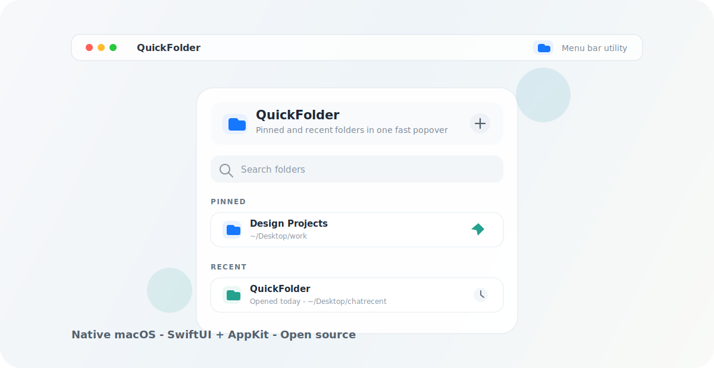

<p align="center">
  
</p>

# QuickFolder

[](#requirements)
[](#tech-stack)
[](LICENSE)

QuickFolder is a native macOS menu bar app for fast access to pinned and recent folders.

It stays out of the Dock, lives in the status bar, and opens folders directly in Finder. The goal is simple: keep the folders you use every day one click away.

## Why QuickFolder?

macOS has recent items, Finder favorites, Dock stacks, and sidebar shortcuts, but none of them are a focused, lightweight menu bar workflow for folders. QuickFolder combines:

- folders you explicitly pin;
- folders you opened recently through QuickFolder;
- best-effort macOS recent-folder signals;
- a compact searchable popover.

## Features

- Native macOS menu bar app built with SwiftUI and AppKit.
- Pinned folders with persistent local storage.
- Recent folders from QuickFolder usage.
- Best-effort macOS recent-folder import from shared file list data.
- Search across folder names and paths.
- Hover actions for pinning, revealing, removing, and forgetting folders.
- Context menu actions for power users.
- Settings for login at startup, recent limit, and macOS recent-folder import.
- Dock-free `LSUIElement` behavior.

## Preview

The current UI is intentionally compact and utility-first:

- top search for fast filtering;
- separate `Pinned` and `Recent` sections;
- one-click open in Finder;
- row actions that appear on hover;
- unavailable folders shown safely instead of crashing.

> The hero image above is an illustrative project preview. Real screenshots will be added as the UI stabilizes.

## Requirements

- macOS 14 or newer.
- Xcode 26.5 or newer is recommended for the current project format.

## Build From Source

Clone the repository:

```sh
git clone https://github.com/yavuz/QuickFolder.git
cd QuickFolder
```

Build from the command line:

```sh
xcodebuild -project QuickFolder.xcodeproj -scheme QuickFolder -configuration Debug build
```

Or open `QuickFolder.xcodeproj` in Xcode and run the `QuickFolder` scheme.

## Install Locally

For a local Release build:

```sh
xcodebuild -project QuickFolder.xcodeproj -scheme QuickFolder -configuration Release build
```

Then copy `QuickFolder.app` from Xcode's `DerivedData` build products into `/Applications`.

Signed and notarized release builds are not available yet.

## Runtime Data and Privacy

QuickFolder stores its local data at:

```text
~/Library/Application Support/QuickFolder/folders.json
```

QuickFolder is local-first:

- it does not intentionally send folder paths or user data to a network service;
- pinned folders may store security-scoped bookmark data so macOS can preserve access;
- macOS recent folders are imported on a best-effort, read-only basis.

Apple does not expose a stable public Finder recent-folder API for this exact use case, so the macOS recent-folder integration should be treated as best effort.

## Tech Stack

- Swift
- SwiftUI
- AppKit
- `NSStatusItem`
- `NSPopover`
- JSON persistence in Application Support

## Roadmap

- Add real screenshots and release artifacts.
- Add signed and notarized builds.
- Improve keyboard navigation.
- Add tests around persistence and folder state.
- Add optional open-with targets such as Terminal or VS Code.
- Polish accessibility labels and VoiceOver behavior.

## Contributing

Contributions are welcome. See [CONTRIBUTING.md](CONTRIBUTING.md) for setup notes, project conventions, and pull request expectations.

Good first areas:

- UI polish;
- accessibility;
- persistence tests;
- better unavailable-folder handling;
- documentation and screenshots.

## License

QuickFolder is released under the [MIT License](LICENSE).
